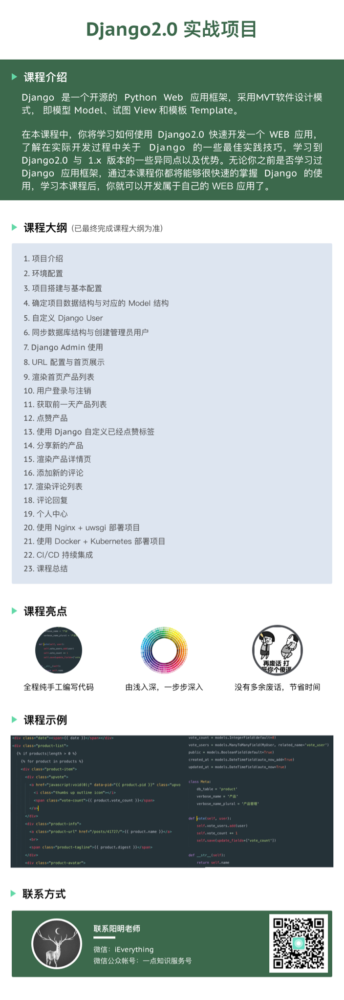

# productaste
基于 django2.0 快速实现一个产品分享的 WEB 应用

课程地址: [https://www.haimaxy.com/course/m12jop/](https://www.haimaxy.com/course/m12jop/?utm_source=github)

每节课的源码和`TAG`是同步的，比如第5节课对应的源码就是`TAG`为**lesson5**对应的源码。

